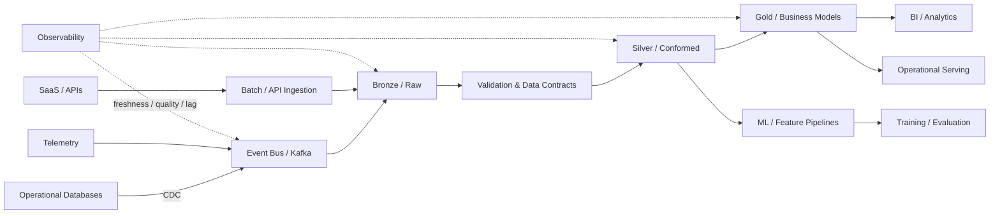

# Reference Architecture

## Design choices

### Ingestion
The ingestion boundary prioritizes durability and replay. Events carry stable identifiers, event timestamps, schema versions, and source metadata.

### Bronze
Bronze preserves source fidelity. Transformations are intentionally minimal so downstream datasets can be rebuilt.

### Silver
Silver resolves types, deduplicates records, applies data contracts, and creates conformed domain datasets.

### Gold
Gold contains business-facing models with documented ownership and quality expectations. Production changes should be code-reviewed and tested.

### Reliability
Key signals include consumer lag, end-to-end latency, freshness, row-count anomalies, null-rate changes, schema drift, failed records, and replay volume.
