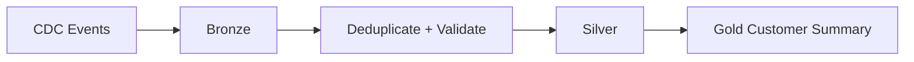

# Lakehouse Platform

This example models a governed lakehouse that ingests customer and order change events into Bronze, creates clean Silver tables, and publishes a Gold customer-order summary.

## Goals

- preserve raw data for replay
- validate contracts before consumption
- deduplicate CDC events deterministically
- isolate business-facing models from ingestion details
- make quality rules executable

## Flow



Run the example from the repository root:

```bash
python projects/lakehouse-platform/pipeline.py
```
